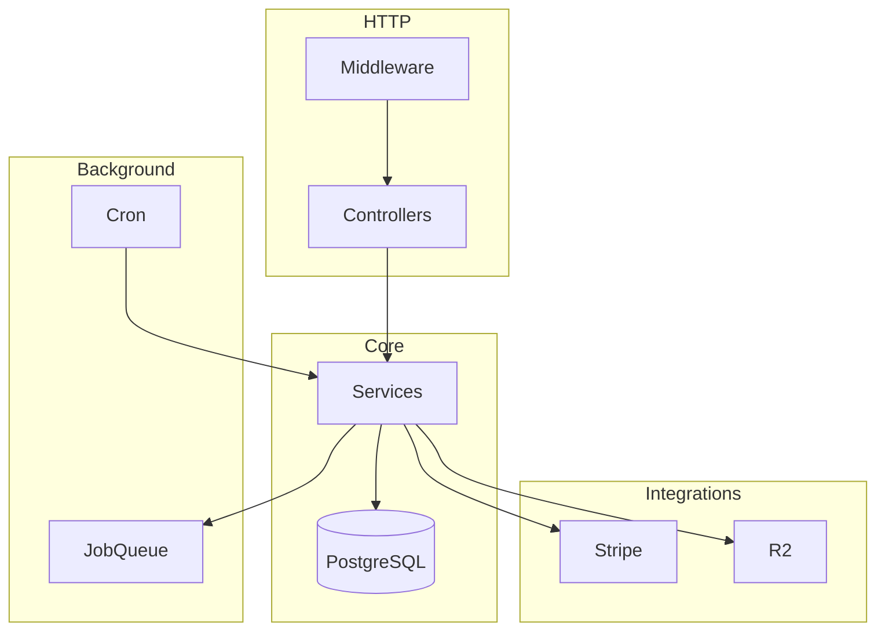

# Luxe API — Architecture

High-level design for developers and AI agents. For coding rules see `.cursorrules`.

## Request flow

```
Client
  → Gin middleware (CORS, access log, Sentry, OTEL, auth)
  → Controller (bind DTO, validate, utils.Response)
  → Service (business logic, transactions)
  → GORM (*gorm.DB) → PostgreSQL
```

Background work:

```
Service → tasks.JobQueue → Asynq (Redis) or in-memory worker
Cron    → internal/jobs/cron_jobs.go
```

## Boot sequence (`cmd/api/main.go`)

1. `config.Load()` — env, production validation
2. Structured logger (`utils.InitLoggerWithConfig`)
3. Sentry (`observability.Init`) — if `SENTRY_DSN`
4. OpenTelemetry (`observability.InitTracing`) — if `OTEL_ENABLED`
5. PostgreSQL (`connectDatabase`)
6. `tasks.NewJobQueue` — Redis if `REDIS_URL`, else in-memory
7. `services.NewServices(db, cfg, jobQueue)` — all domain services
8. `tasks.BindHandlers` — order process, shipment process
9. `jobs.NewCronJobs` — scheduled tasks
10. `controllers.NewContainer` — HTTP handlers
11. `routes.NewRouter` → `Setup()` — register routes
12. Graceful shutdown — HTTP, cron, job queue (15s)

## Dependency injection

| Layer | Registry | Adds |
|-------|----------|------|
| Services | `internal/services/services.go` | `NewServices` |
| Controllers | `internal/controllers/container.go` | `NewContainer` |
| Routes | `internal/routes/*_routes.go` | per-domain groups |

New domains must be registered in **both** `services.go` and `container.go`.

## HTTP surface

- API prefix: `/api/v1`
- Public routes: `GuestAuthMiddleware` (optional JWT)
- Protected routes: `AuthMiddleware` (required JWT)
- Health: `/api/v1/health`, `/api/v1/health/live`, `/api/v1/health/ready`
- Swagger UI: `/swagger/index.html` (requires generated `docs/`)
- OpenAPI 3 JSON: `/openapi`
- Stripe webhook: `/api/v1/webhooks/stripe` (no JWT)

## Domain modules

| Domain | Service | Notes |
|--------|---------|-------|
| Auth / users | `auth_service`, `user_service` | JWT, refresh tokens, email verification |
| Catalog | `product_services`, `category_service`, `brand_service`, `pdp_service`, `search_service` | PDP, compare, likes |
| Cart | `cart_service` | Stock checks, active cart |
| Orders | `orders_service`, `checkout_service` | Checkout transaction, inventory |
| Payments | `payment_service`, `wallet_service` | mock / stripe / wallet |
| Fulfillment | `shipment_service`, `address_service` | Async shipment jobs |
| Engagement | `review_service`, `coupon_service`, `notification_service` | WebSocket hub |
| Platform | `audit_service`, `upload_service`, `settings_service` | Audit logs, R2 presign |
| Store / nav | `store_setvice`, `menu_service`, `nav_menu_service` | Admin menus, mega menu |

## Data access

**Default:** services hold `*gorm.DB` and use `db.WithContext(ctx)`.

Complex list/filter queries use private helpers on the service (e.g. `orderService.listOrders`). No separate repository package.

Multi-step writes use `db.Transaction` (checkout, payments, stock).

## External integrations

| Package | Purpose | Config |
|---------|---------|--------|
| `internal/integrations/stripe` | Checkout sessions, webhooks | `STRIPE_*` |
| `internal/integrations/r2` | Presigned uploads | `R2_*` |

## Observability

| Feature | Package / middleware | Env |
|---------|---------------------|-----|
| JSON logs | `utils/logger`, `middleware/access_log` | `LOG_LEVEL`, `SERVICE_NAME` |
| Sentry | `observability`, `middleware/sentry` | `SENTRY_DSN` |
| Tracing | `observability/tracing`, `middleware/tracing` | `OTEL_ENABLED`, `OTEL_EXPORTER_OTLP_ENDPOINT` |
| Health | `internal/health` | DB + Redis when configured |

## Database

- Migrations: Goose, `internal/migrations/`
- Create: `make migrate-create name=<name>`
- Apply: `make migrate-up`
- **New migrations: schema only** — no demo product seeds

## Testing

| Type | Location | Notes |
|------|----------|-------|
| Unit | `internal/services/*_test.go` | sqlmock for DB isolation |
| Integration | `tests/integration/` | Real Postgres, `TestMain` in `setup_test.go` |
| E2E | `tests/e2e/` | Placeholder / future |

Integration fixtures use unique suffixes (`seedProduct`) — real inserts, not mocked JSON.

## API documentation

Swagger is generated from controller comments + `cmd/api/main.go` metadata.

```bash
make swagger
```

Output: `docs/` (gitignored). Never hand-edit generated files.

## Diagram


