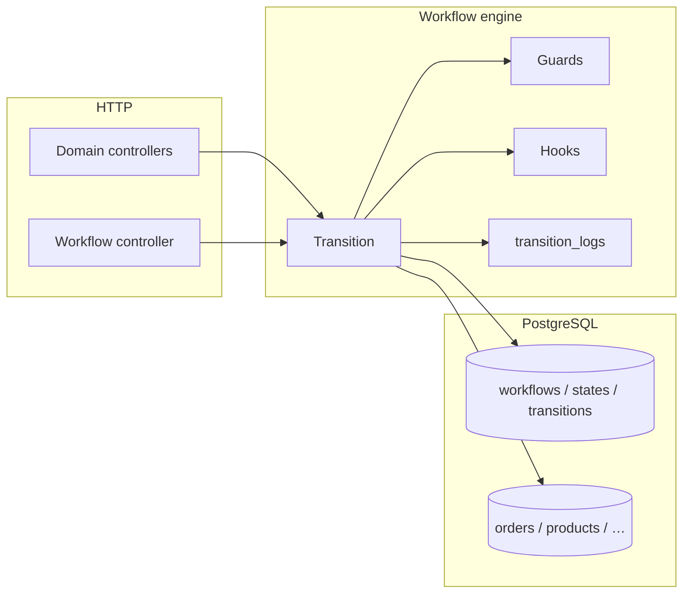
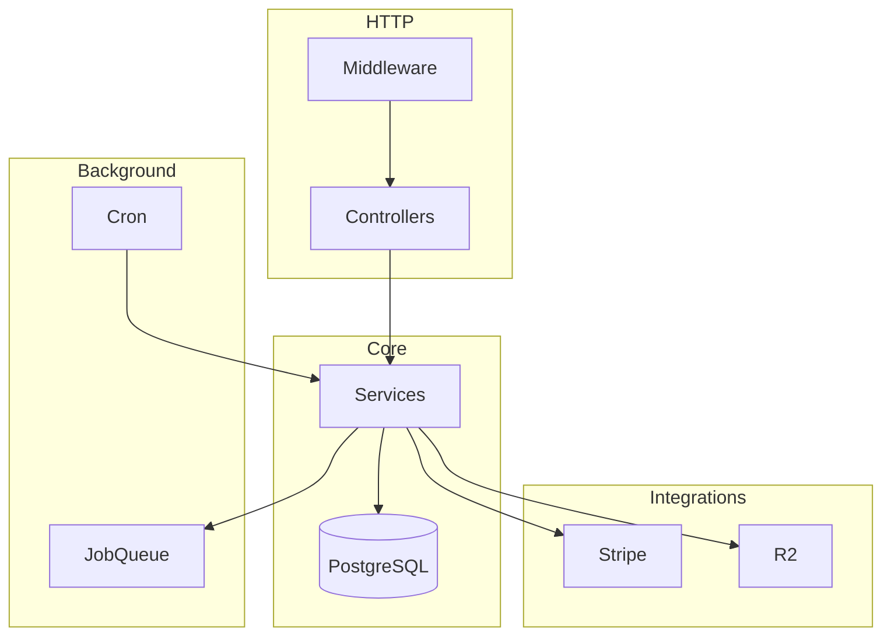

# Luxe API — Architecture

High-level design for developers and AI agents. For coding rules see `.cursorrules`.

## Request flow

```
Client
  → Gin middleware (CORS, access log, Sentry, OTEL, auth)
  → HTTP handler (bind DTO, validate, utils.Response)
  → Service facade (internal/services — wiring, workflow sync, WS/notifications)
  → Application (commands/queries — use cases)
  → Domain (rules, ports)
  → infrastructure/postgres (GORM) → PostgreSQL
```

Background work:

```
Service → asynq.JobQueue → Asynq (Redis) or in-memory worker
Cron    → internal/jobs/cron_jobs.go
```

## Package layout

| Path | Role |
|------|------|
| `internal/interfaces/http/handlers/` | Gin HTTP handlers (was `controllers/`) |
| `internal/interfaces/http/dto/` | Request/response DTOs |
| `internal/interfaces/http/routes/` | Route registration |
| `internal/interfaces/http/middleware/` | Auth, CORS, logging, tracing |
| `internal/services/` | Thin facades + registry (`registry.go`); workflow sync, WebSocket, cross-cutting orchestration |
| `internal/domain/` | Pure domain entities, ports, rules |
| `internal/application/` | Use-case orchestration (commands/queries per bounded context) |
| `internal/infrastructure/postgres/` | GORM repository implementations |
| `internal/infrastructure/asynq/` | Background job queue |
| `internal/infrastructure/integrations/` | Stripe, R2, AI, PDF |
| `internal/shared/utils/` | Response helpers, logger, JWT |
| `internal/shared/observability/` | Sentry, OTEL, Prometheus |
| `internal/shared/health/` | Liveness/readiness checks |

## Boot sequence (`cmd/api/main.go`)

1. `config.Load()` — env, production validation
2. Structured logger (`shared/utils.InitLoggerWithConfig`)
3. Sentry (`shared/observability.Init`) — if `SENTRY_DSN`
4. OpenTelemetry (`shared/observability.InitTracing`) — if `OTEL_ENABLED`
5. PostgreSQL (`connectDatabase`)
6. `asynq.NewJobQueue` — Redis if `REDIS_URL`, else in-memory
7. `bootstrap.NewServices(db, cfg, jobQueue)` — all domain service facades
8. `asynq.BindHandlers` — order process, shipment process
9. `jobs.NewCronJobs` — scheduled tasks
10. `handlers.NewContainer` — HTTP handlers
11. `routes.NewRouter` → `Setup()` — register routes
12. Graceful shutdown — HTTP, cron, job queue (15s)

## Dependency injection

| Layer | Registry | Adds |
|-------|----------|------|
| Services | `internal/application/bootstrap/wire.go` | `bootstrap.NewServices` |
| Registry type | `internal/services/registry.go` | `services.Services`, `JobHandlers` |
| Handlers | `internal/interfaces/http/handlers/container.go` | `NewContainer` |
| Routes | `internal/interfaces/http/routes/*_routes.go` | per-domain groups |

New domains must be registered in **both** `bootstrap/wire.go` and `handlers/container.go`.

## HTTP surface

- API prefix: `/api/v1`
- Public routes: `GuestAuthMiddleware` (optional JWT)
- Protected routes: `AuthMiddleware` (required JWT)
- Health: `/api/v1/health`, `/api/v1/health/live`, `/api/v1/health/ready`
- Swagger UI: `/swagger/index.html` (requires generated `docs/`)
- OpenAPI 3 JSON: `/openapi`
- Stripe webhook: `/api/v1/webhooks/stripe` (no JWT)

## Domain modules

| Domain | Service | Notes |
|--------|---------|-------|
| Auth / users | `auth_service`, `user_service` | JWT, refresh tokens, email verification |
| Catalog | `product_services`, `category_service`, `brand_service`, `pdp_service`, `search_service` | PDP, compare, likes |
| Cart | `cart_service` | Stock checks, active cart |
| Orders | `orders_service`, `checkout_service` | Checkout transaction, inventory |
| Payments | `payment_service`, `wallet_service` | Stripe Checkout (orders + wallet deposits), mock when Stripe disabled, wallet balance |
| Fulfillment | `shipment_service`, `address_service` | Async shipment jobs |
| Returns | `return_service` | Return/refund workflow |
| Workflow | `workflow` engine, `workflow_service` | DB-driven state machine (see below) |
| Engagement | `review_service`, `coupon_service`, `notification_service` | WebSocket hub |
| Platform | `audit_service`, `upload_service`, `settings_service` | Audit logs, R2 presign |
| Store / nav | `store_setvice`, `menu_service`, `nav_menu_service` | Admin menus, mega menu |

## Data access

**Default:** services hold `*gorm.DB` and use `db.WithContext(ctx)`.

Complex list/filter queries use private helpers on the service (e.g. `orderService.listOrders`). No separate repository package.

Multi-step writes use `db.Transaction` (checkout, payments, stock).

## External integrations

| Package | Purpose | Config |
|---------|---------|--------|
| `internal/infrastructure/integrations/stripe` | Checkout sessions (orders + wallet deposits), webhooks | `STRIPE_*` |
| `internal/infrastructure/integrations/r2` | Presigned uploads | `R2_*` |

## Observability

| Feature | Package / middleware | Env |
|---------|---------------------|-----|
| JSON logs | `shared/utils`, `interfaces/http/middleware/access_log` | `LOG_LEVEL`, `SERVICE_NAME` |
| Sentry | `shared/observability`, `interfaces/http/middleware/sentry` | `SENTRY_DSN` |
| Tracing | `shared/observability/tracing`, `interfaces/http/middleware/tracing` | `OTEL_ENABLED`, `OTEL_EXPORTER_OTLP_ENDPOINT` |
| Health | `internal/shared/health` | DB + Redis when configured |

## Database

- Migrations: Goose, `internal/migrations/`
- Create: `make migrate-create name=<name>`
- Apply: `make migrate-up`
- **New migrations: schema only** — no demo product seeds

## Testing

| Type | Location | Notes |
|------|----------|-------|
| Unit | `internal/services/*_test.go` | sqlmock for DB isolation |
| Integration | `tests/integration/` | Real Postgres, `TestMain` in `setup_test.go` |
| E2E | `tests/e2e/` | Placeholder / future |

Integration fixtures use unique suffixes (`seedProduct`) — real inserts, not mocked JSON.

## API documentation

Swagger is generated from controller comments + `cmd/api/main.go` metadata.

```bash
make swagger
```

Output: `docs/` (gitignored). Never hand-edit generated files.

Regenerate after changing controller `@Summary` / `@Router` comments or workflow DTOs:

```bash
make swagger
```

Open locally: `http://localhost:<port>/swagger/index.html` (requires `make swagger` first).

---

## Workflow state machine

Luxe uses a **DB-driven workflow engine** so lifecycle rules (states, transitions, colors, guards, hooks) can be changed without redeploying hard-coded status enums. The engine is the authority; entity `workflow_state_id` columns point at `workflow_states`. Legacy `status` columns on orders, products, and shipments are **mirrors** updated by the engine for backward compatibility.

### Package layout

| Path | Role |
|------|------|
| `internal/infrastructure/workflow/engine.go` | `Transition`, `SetState`, `AvailableTransitions`, `History` |
| `internal/application/workflow/hooks.go` | Registered guards and post-transition hooks |
| `internal/application/workflow/sync.go` | Legacy status → event/SetState helpers used by facades |
| `internal/services/workflow_service.go` | Workflow definition CRUD facade |
| `internal/migrations/20260617200000_workflow_engine.sql` | Schema |
| `internal/migrations/20260617210000_workflow_seed.sql` | Seed definitions for five workflows |

Boot wiring (`bootstrap.NewServices`):

1. `workflow.NewEngine(db)`
2. `application/workflow.RegisterGuardsAndHooks(...)` and `RegisterInventoryHooks(...)`
3. Pass `engine` into order, product, shipment, checkout, auth, admin, return services

### Data model

```
workflows
  └── workflow_states (code, name, color, is_initial, is_final)
  └── workflow_transitions (from_state, to_state, event, required_role, guard_key, hook_key)
  └── workflow_transition_logs (immutable audit: who, when, from → to, success/error)

orders / products / shipments / users / returns
  └── workflow_state_id → workflow_states.id
  └── status (mirror on order/product/shipment/return — engine-written where configured)
```

- **`from_state_id = NULL`** on a transition row means a wildcard: the event is valid from any current state (e.g. order `cancel`).
- **`required_role`** on a transition is enforced by the engine against the caller's JWT role (`admin`, etc.).
- **`guard_key` / `hook_key`** reference functions registered in Go (`RegisterGuard` / `RegisterHook`); keys in the DB must match.

### Transition flow

```
POST …/transition  { "event": "ship", "note": "…" }
  → Controller (bind DTO, actor from JWT)
  → Service (optional entity existence check)
  → engine.Transition(ctx, TransitionRequest{…})
       1. Load workflow + current workflow_state_id from entity row
       2. Match transition row (from_state + event, or wildcard + event)
       3. Check required_role
       4. Run guard (if guard_key set) — veto → 400
       5. Update workflow_state_id (+ mirror status column if configured)
       6. Insert workflow_transition_logs row
       7. Run hook (if hook_key set) — notifications, wallet credit, timestamps, etc.
  → Response: TransitionResultView + reloaded entity (domain endpoints)
```

**`SetState`** (used by `application/workflow/sync.go` for legacy code paths) moves an entity to a target state **without** guards or hooks — audit only. Prefer **`Transition`** for admin actions and new code.

### Seeded workflows

| Key | Entity | Initial state | Notable events |
|-----|--------|---------------|----------------|
| `product` | products | `draft` | `submit_for_review`, `approve`, `reject`, `publish`, `mark_out_of_stock`, `restock`, `discontinue`, `archive` |
| `order` | orders | `created` | `await_payment`, `payment_succeeded`, `start_processing`, `pack`, `ship`, `deliver`, `complete`, `refund`, `cancel` (wildcard) |
| `shipment` | shipments | `pending` | `ready`, `pick_up`, `depart`, `out_for_delivery`, `deliver`, `delivery_failed`, `retry_delivery`, `return_to_sender` |
| `return` | returns | `requested` | `approve`, `reject`, `receive_item`, `start_refund`, `complete_refund`, `close` |
| `user` | users | `registered` | `verify_email`, `suspend`, `unsuspend`, `block`, `unblock`, `delete_account` |

State **colors** (`workflow_states.color`, `text_color`) are intended for admin UI badges. Fetch a full definition with `GET /api/v1/workflows/:key`.

### Guards and hooks (Go)

| Key | Type | Behavior |
|-----|------|----------|
| `product_has_price` | guard | Blocks `submit_for_review` when price ≤ 0 |
| `order_payment_succeeded` | guard | Blocks `payment_succeeded` when latest payment failed |
| `order_cancellable` | guard | Blocks `cancel` on delivered/completed/refunded/cancelled orders |
| `product_published` | hook | Sets `products.published_at` |
| `order_paid` / `order_shipped` / `order_refunded` / `order_cancelled` | hook | Notification + async email |
| `shipment_delivered` | hook | Sets `shipments.delivered_at` |
| `return_refunded` | hook | Credits customer wallet via `wallet.Refund` |

Add new side effects by registering keys in `application/workflow.RegisterGuardsAndHooks` and referencing them from transition rows (admin CRUD or seed migration).

### Status mirroring

For entities with `statusMirror: true`, the engine maps workflow state codes to legacy status strings after each transition (see `statusMirrorMaps` in `engine.go`). Examples:

- Order: `created` → `pending`, `paid` stays `paid`, etc.
- Product: `published` / `out_of_stock` → `active`, `discontinued` → `inactive`
- Shipment: `in_transit` / `out_for_delivery` → `shipped`, `ready_for_pickup` → `processing`

Existing services call `application/workflow.ApplyOrderWorkflow` / `ApplyProductWorkflow` / `ApplyShipmentWorkflow` when they still update status strings directly; those helpers try **`Transition`** first (mapped event), then fall back to **`SetState`**.

### HTTP API

**Generic (authenticated JWT):**

| Method | Path | Purpose |
|--------|------|---------|
| GET | `/workflows/:key` | Full definition (states + transitions + colors) |
| GET | `/workflows/:key/:entityId/available-transitions` | Current state + allowed actions for caller's role |
| POST | `/workflows/:key/:entityId/transition` | Fire event `{ "event", "note", "metadata"? }` |
| GET | `/workflows/:key/:entityId/history` | Audit log for one entity |

**Admin — definition CRUD:** `/admin/workflows`, `/admin/workflows/:id/states`, `/admin/workflows/:id/transitions`

**Admin — domain shortcuts** (same engine, reload entity in response):

| Domain | Available transitions | Perform transition |
|--------|----------------------|-------------------|
| Product | `GET /products/:id/available-transitions` | `POST /products/:id/transition` |
| Order | `GET /orders/:id/available-transitions` | `POST /orders/:id/transition` |
| Shipment | `GET /shipments/:id/available-transitions` | `POST /shipments/:id/transition` |
| Return | — | `POST /admin/returns/:id/transition` |

**Legacy (prefer transition API for new admin UI):**

- `PUT /orders/:id/status` — maps status string via `application/workflow/sync`
- `PUT /shipments/:id/status` — manual status + WS broadcast

**Customer:**

- `POST /orders/:id/cancel` — uses `Transition("cancel")` with `order_cancellable` guard
- `POST /returns` — creates return in `requested` state

### Frontend integration (luxe-front)

Recommended pattern:

1. `GET /workflows/product` (or order/shipment) once — cache state colors and labels.
2. For an entity row/detail: `GET …/available-transitions` — render action buttons from `transitions[]` (use `event` as POST body, `name` as label, `to_state.color` for preview).
3. Optional timeline: `GET /workflows/:key/:entityId/history`.
4. Badge: resolve `current_state` from available-transitions response, or join `workflow_state_id` with cached definition states.

Orval: run `pnpm api:gen` in luxe-front after `make swagger` when the OpenAPI spec includes these routes.

### Diagram



---

## System diagram


